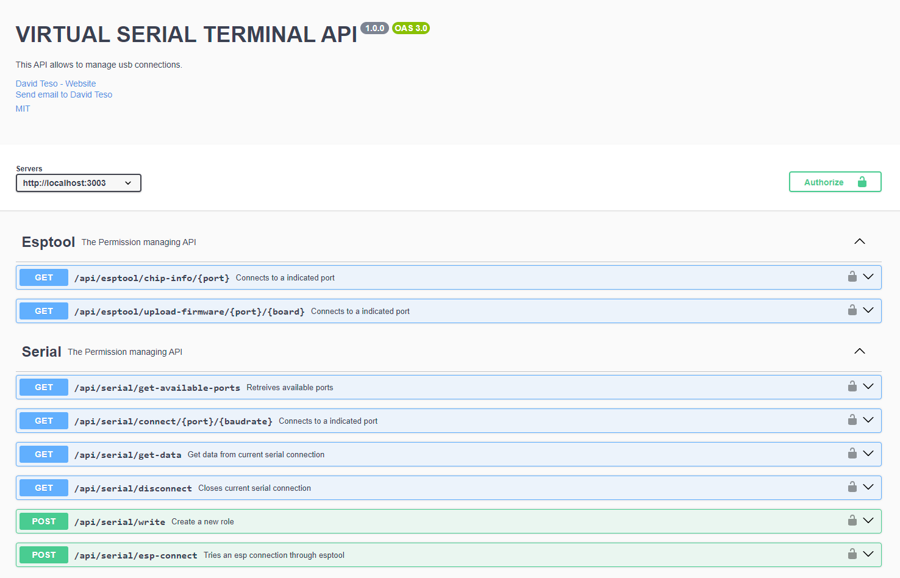

# UTILIZAR ESTE PROYECTO

## INSTALACIÓN Y ARRANQUE

    1. npm install

    2. crear fichero.env con una variable

        PORT=3003 // o el que se considere

    2. tsc // o tsc --watch en consola a parte

    3. node .\dist\app.js

    4. En la consola se mostrará la siguiente información:

    [INFO] STARTING NODE-TS SERVER
    [WS_RUNNING] Sockets Server corriendo en el puerto 4443
    [SUCCESS] SERVER RUNNING ON PORT: 3003
    [INFO] Swagger Docs available at http://localhost:3003/api/v1/docs
    Getting available ports

## SWAGGER

Se exponen algunos endpoints para el control del puerto serie así como para lanzar la carga de programas en las placas.

# ESPTOOLS INTERNAL COMMANDS

## Comprobar información de la placa 
    
    .\libs\esptool\esptool.py flash_id

    .\libs\esptool\esptool.py --port COM? flash_id

## Volcar binario directamente en la placa

    .\libs\esptool\esptool.py --port COM4 --baud 115200 write_flash 0x00000 C:\Projects\LEMUR_SOFTWARE\virtual-serial-terminal\public\kurage_d1_mini\firmware.bin 

### ESP32 (Con particiones)

    .\libs\esptool\esptool.py 
    --chip esp32 
    --port "COM3" 
    --baud 460800 
    --before default_reset 
    --after hard_reset write_flash -z 
    --flash_mode dio 
    --flash_freq 40m 
    --flash_size 4MB 
    0x1000 C:\Users\d_tes\.platformio\packages\framework-arduinoespressif32\tools\sdk\esp32\bin\bootloader_dio_40.bin 
    0x8000 C:\Projects\ESP_SYNAPSE\Boards\kurage_esp32_s\.pio\build\nodemcu-32s\partitions.bin 0xe000 C:\Users\d_tes\.platformio\packages\framework-arduinoespressif32\tools\partitions\boot_app0.bin 
    0x10000 C:\Projects\LEMUR_SOFTWARE\virtual-serial-terminal\public\esp_32\firmware.bin

Las particiones deben estar definidas en un fichero .csv con este contenido

    # Name,   Type, SubType, Offset,  Size, Flags
    nvs,      data, nvs,     0x9000,  0x5000,
    otadata,  data, ota,     0xe000,  0x2000,
    app0,     app,  ota_0,   0x10000, 0x300000,
    spiffs,   data, spiffs,  0x310000,0xF0000,

### ESP8266

Para el ESP8266 no es necesario el uso de particiones y el comando se simplifica.

    .\libs\esptool\esptool.py --before default_reset --after hard_reset --chip esp8266 --port "COM4" --baud 115200 write_flash 0x0 .\public\kurage_d1_mini\firmware.bin  